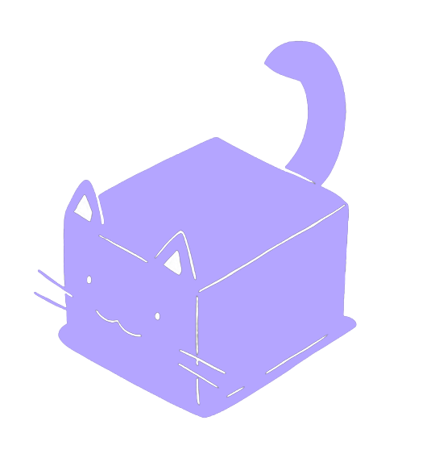
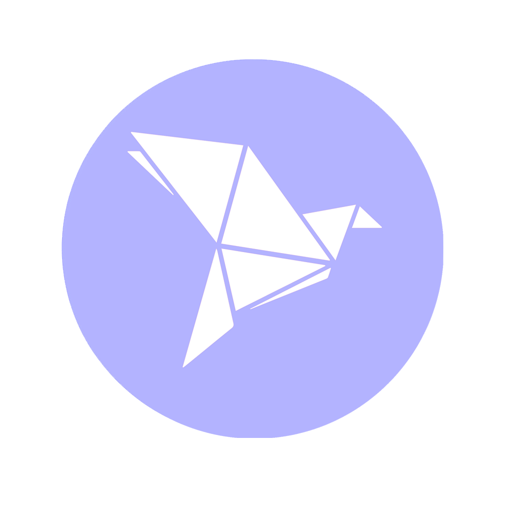

# 🐾 Nekodop – Cat Adoption & Management Platform

**Nekodop** is a small-scale university project designed to streamline the process of cat adoption. Built entirely using **Vanilla HTML, CSS, and JavaScript**, it features both **user-facing functionality** and a basic **admin management panel**. It's powered by **SQLite** for database management, uses **Cloudinary** for image hosting, and integrates **Font Awesome** for UI icons.

  

---

## 📌 Project Summary

Nekodop allows users to register, log in, and post cats they want to give up for adoption. Admins can manage users and moderate the adoption posts by approving, rejecting, or deleting them. The platform also includes a simple **donation section** via **bKash**, encouraging community support.
Your contributions help us maintain the platform and support our mission of finding homes for cats in need. Every donation, big or small, makes a difference. Cozy community built for cat lovers

---

## 🌐 Live Features Overview

### 👤 User Features
- Register and login with basic credentials
- Post cats for adoption (Name, Age, Gender, Description, Image, Contact Info)
- Edit or delete their own cat posts
- See approval status: Pending, Approved, or Rejected

### 🛠️ Admin Features
- View all users
- Delete any user
- View, approve, reject, or delete cat adoption posts

### 💰 Donation Section
- bKash Payment Integration (manual)
- Users can support the platform through donations

---

## 📸 Technologies Used

| Technology | Purpose |
|------------|---------|
| **HTML** | Markup structure |
| **CSS** | Styling the interface |
| **JavaScript** | Dynamic UI behavior and logic |
| **SQLite** | Lightweight, file-based database |
| **Cloudinary** | Hosting cat images securely |
| **Font Awesome** | Iconography and UI elements |

---

## 💝 Donation Details

If you'd like to support the development or help more cats get adopted:

**bKash Number:** `01630844517`  
**Account Type:** `Personal`  
**Reference:** `Nekodop Donation` *(Please mention this during payment)*

Thank you for your generosity 🐾💕

---

## 👥 Contributors

| Name | GitHub Profile | Role |
|------|----------------|------|
| **Abubakar Siddiq Sazzad (Kaito)** | [@nekokaito](https://github.com/nekokaito) | Fullstack Developer, Project Lead |
| **Ruhan Rouf** | [@Ruhannn](https://github.com/Ruhannn) | Backend (Python) |
| **Maliha Benta Mobarak** | [@mlhsumu](https://github.com/mlhsumu) |  Front-end, Marketing |
| **Adil Rahman** | [@mursalindev](https://github.com/Coded-Adil) | Front-end |

---

## 📄 License

This project is built for educational purposes and is free to use or extend. Attribution appreciated!
